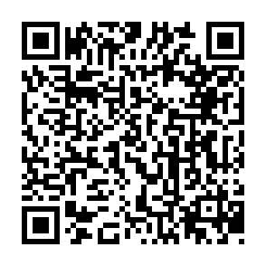

# Two Way Communications in Disasters **https://ccsfist.github.io/TwoWayDisasterCommunication** +1-646-217-0881

## Session Participation Materials

## Disaster Readiness Summit with The National Center for Disaster Preparedness, 2:00PM - 4:00 PM, Wednesday, Sept 23nd at Teachers College, Columbia University

## **Text or whatsapp "2wayBuzzwords" to +1 (646) 217-0881 to create your own annoying and/or badly needed buzzword**

 

