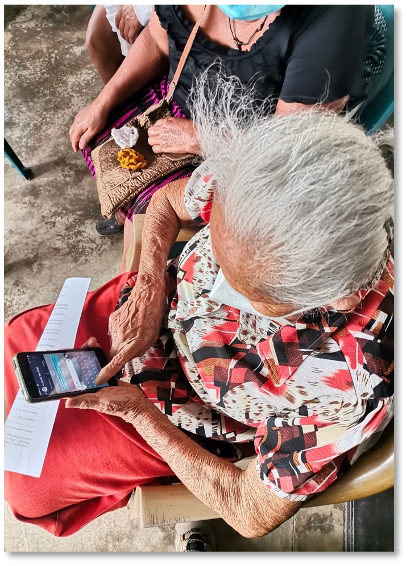

# Two Way Communications in Disasters: Going beyond alerts with Tribal Nations and New York City

## Disaster Readiness Summit with The National Center for Disaster Preparedness, 2:00PM - 4:00 PM, Wednesday, Sept 23nd at Teachers College, Columbia University

## Much of this work is made possible by funding from the Twilio.org Impact Fund

 

Have you ever gotten a disaster alert on your phone?  Did you find it hard to know what to really do, or how to get the help thats right for you? Disaster coordination is really hard, and with the growing frequency of disasters we need much quicker and more effective communication.  This is especially challenging for vulnerable populations in Tribal Nations and urban areas.

What if you could be asked a question about what you need, instead of simply getting a one way alert?  What if we could work together to design evacuation and shelter systems? 

If you want to see some new approaches, we will be playing through new tools and strategies being discussed by Tribal Nations, communications providers, disaster experts, and cities working with students from impacted communities to explore future solutions. 

Tired of the same old buzzwords? Please be thinking of new Buzzwords that are valuable to be able to help people talk about the most important things in Anticipatory Action.

## **Text or whatsapp "2wayBuzzwords" to +1 (646) 217-0881 to create your own annoying and/or badly needed buzzword**

 

